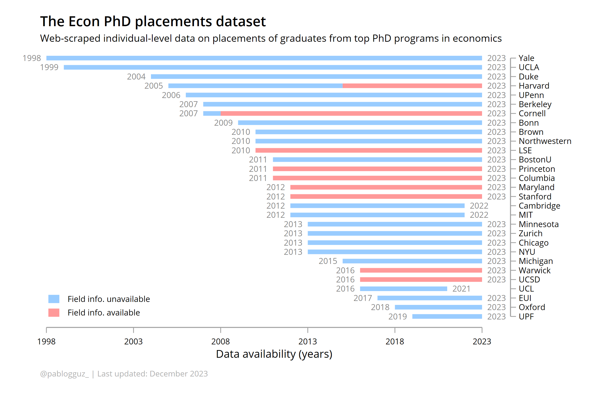

 

# Placement outcomes for PhD graduates in economics

I construct a novel dataset with individual-level information on PhD placement outcomes for a total of 28 economics departments worldwide. Data is extracted directly from the relevant departmental websites through web-scraping.

Placements are then sorted into 7 different categories using a text classification algorithm, namely **tenure-track positions, 
post-docs and other academic positions, central banks, international organizations, government, think-tanks and non-profits,** and **private sector**.

This GitHub repository hosts the code for replicating the data construction. The final dataset can be found in `0_data/all/scraped_data_proc.dta`

Notes:
* MIT has stoped publishing their placement record on their website. The data for MIT in this dataset was retrieved in 2022Q2 (from the previous edition), when it was still available
* Chicago discloses their placements in a PDF document available on their website. In 2023, they removed data for years prior to 2019 from the publicly available document. The data for Chicago up to 2018 in this dataset was retrieved in 2022Q2 (from the previous edition)
* In the previous edition of the dataset, placements were distributed across 8 distinct categories, with post-docs and other academic positions classified separately. The latest version consolidates these two into a single category
* When multiple placement outcomes exist for a single graduate, and provided the graduate can be identified, only the initial placement is retained
* A small number of placements (~0.3%) were removed from the final dataset due to their descriptions being too vague for categorization
* Information on fields is stored in columns `primary_field` and `secondary_field`. A condensed classification of field categories based on the primary field is available in column `field_type`
* To discern between tenure-track and post-docs placements, the text classification algorithm requires that post-docs are explicitly flagged. Unfortunately, this is not always the case &ndash; some schools omit this information from the placement outcome, often making tenure-track positions and post-docs undistinguishable. Due to this, the share of tenure-track placements is expected to be upward-biased

